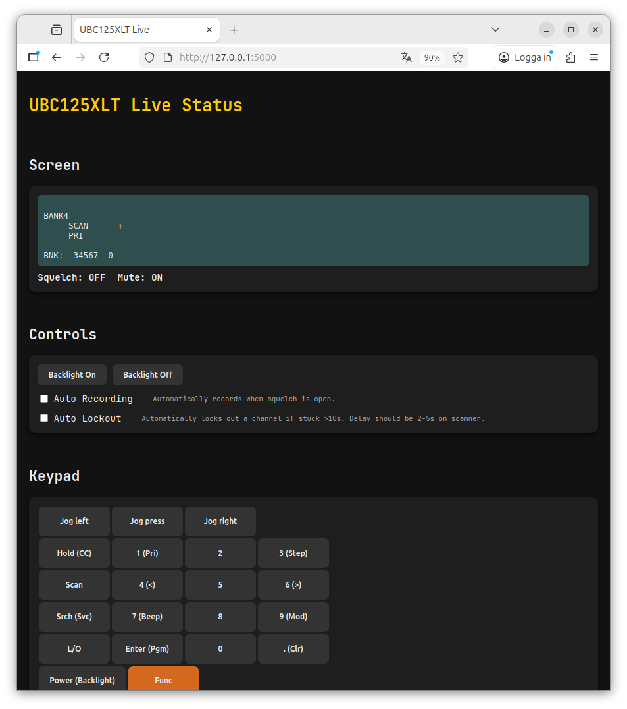

# Uniden BC125AT/UBC125XLT Linux Web Controller
A web-based control and recording interface for the Uniden Bearcat BC125AT/UBC125XLT scanner. This project provides:
- A FastAPI backend for communicating with the scanner over USB
- A real-time web UI for controlling keys, channels, backlight, and automatic recording
- Automatic audio recording based on squelch state
- Recording toggle (enable/disable) via the frontend
- Works on Linux with Python ≥ 3.10



## 📦 Prerequisites
### 1. Check Python Version
Ensure your system is running Python 3.10 or later:

```python3 --version```

If the output shows Python 3.10.x or newer, you're good.
## ⚙️ Setup
### 1. Clone the Repository
```
cd ~/Documents/GitHub
git clone <repo-url>
cd ubc125xlt-linux-controller
```
### 1.1 Install python venv
```
sudo apt update
sudo apt install python3-venv
```
### 1.2 Install system libraries
This project requires PortAudio for audio support. On Ubuntu, you need to install the system libraries before installing Python dependencies:
```
sudo apt update
sudo apt install -y portaudio19-dev libasound2-dev
```

### 2. Create a Virtual Environment
```
python3 -m venv venv
```
Activate it:
```
source venv/bin/activate
```
### 3. Install the Project
```pip install -e .```
## 🔌 Connecting the Scanner
1. Turn on the BC125AT/UBC125XLT  
2. Ensure it is scanning or idle  
3. Plug in the USB cable after the scanner is powered on (helps avoid detection issues)
4. List USB devices with ```ls /dev/ttyACM*```. You may need to update variable DEVICE in scanner_api.py with the correct device path.
5. Run ```sudo usermod -aG dialout $USER```
6. Restart your computer to make sure the changes take effect.
7. After restarting, verify that your user is in the `dialout` group by running:```groups```. You should see `dialout` listed among the groups.
## 🚀 Starting the Web API Server
Run:
```
uvicorn scanner_api:app --host 0.0.0.0 --port 5000 --log-level warning
```
```--host 0.0.0.0``` allows access from other devices on the network

- Web UI: http://0.0.0.0:5000/ or http://127.0.0.1:5000/

### 4. Recordings
Before recording, ensure that you have selected the correct audio input for your line-in in Linux sound settings.

For reference, I have configured my system as follows:

Line-in threshold: 20%

Scanner volume: 6

This helps prevent the input from being overdriven and ensures clean recordings.

## 🐧 Linux USB Note (Important)
If /dev/ttyACM0 does not appear, run:
```
echo "1965 0017 2 076d 0006" | sudo tee -a /sys/bus/usb/drivers/cdc_acm/new_id
```
## ✨ Features
- Real-time scanner status (screen, squelch, mute, frequency, modulation, tone)
- Full keypad emulation
- Channel jumping
- Backlight control
- Automatic audio recording when squelch opens
- Recording toggle via frontend checkbox
- Modular FastAPI backend

## 🙏 Acknowledgements

Serial communication with the scanner is handled using the excellent
[Bearcat Python library](https://github.com/fruzyna/bearcat)
by fruzyna.
